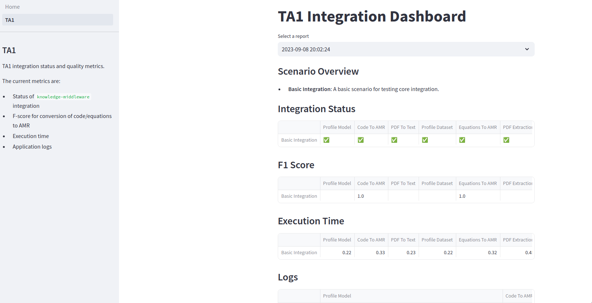

# Integration Dashboard

This dashboard provides the statuses of ASKEM's TA1 services.
Specifically, the dashboard indicates
- If an operation works with `knowledge-middleare`
- How long that operation takes to complete
- The quality of the outputs (not yet implemented)

Currently, the dashboard is testing `knowledge-middleware` integration
but other services and TAs might be checked in the future.



## Usage
To set up the project, run
```
make init  
```

To add a new report, run
```
make report
```
This uploads a `report_{datetime}.json` to S3 which the dashboard reads
off of directly.


To view the current status, start the [Streamlit](https://streamlit.io/) app
by running:
```
docker build . -t integration-dashboard
docker run --name dashboard -p8501:8501 integration-dashboard
```
Upon execution, you can pass the following environment variables (with `docker run` do `-e ENV_NAME='ENV_VAL'` for each variable).

- `AWS_ACCESS_KEY_ID` and `AWS_SECRET_ACCESS_KEY`: Standard credentials for reading and writing to S3
- `BUCKET`: The bucket you'd like to read and write to.
- `SKEMA_RS_URL`, `TA1_UNIFIED_URL`, and `MIT_TR_URL`: Provide overrides for the services being used.
